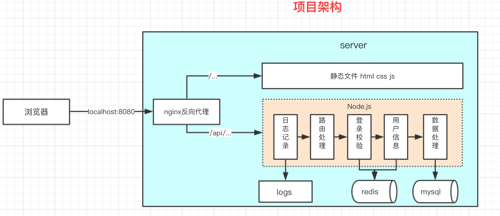

# Blog_Node

## 概况

本项目分别使用原生 Node.js、Express和koa2 框架开发 web Server，重点是 node 作为server 的应用，前后端分离，前端的交互以及样式没有过多的开发。

## 项目收益
1.从服务端角度出发，结合客户端，对整站开发加深认识，包括且不局限于接口设计、路由设计、日志记录、登录校验、抽象复用代码与具体业务解耦。

2.加深对中间件的认知，从源码角度学习了它的 [实现原理](https://github.com/rujinshi/personalNotes/blob/master/%E6%80%BB%E7%BB%93%26%E5%8D%9A%E5%AE%A2/15.express%E4%B8%AD%E9%97%B4%E4%BB%B6%E6%BA%90%E7%A0%81%E5%AD%A6%E4%B9%A0.md)。

3.对后端相关技术（redis、nginx、mysql）有初步了解与使用。

## 项目架构


## 接口设计

| 功能               | 接口             | 方法 | params         |                      备注 |
| :----------------- | :--------------- | :--: | -------------- | ------------------------: |
| 登录               | /api/user/login  | POST |                | postData 中有用户名和密码 |
| 博客列表           | /api/blog/list   | GET  | author,keyword |  参数为空则不进行过滤查询 |
| 获取一篇博客的内容 | /api/blog/detail | GET  | id             |                           |
| 新增一篇博客       | /api/blog/new    | POST |                |       post 中有新增的信息 |
| 更新一篇博客       | /api/blog/update | POST | id             |   postData 中有更新的内容 |
| 删除一篇博客       | /api/blog/del    | POST | id             |                           |

## 目录结构

```js
├── app.js
├── bin
│   └── www.js  //单纯的入口 与业务代码没有关系
├── logs  // 生产环境日志
│   ├── access.log
│   ├── error.log
│   └── event.log
├── src
│   ├── conf  // mySql 和 redis 配置文件
│   │   └── db.js
│   ├── controller  // controller 分发用户请求
│   │   ├── blog.js
│   │   └── user.js
│   ├── db   // 执行查询语句
│   │   ├── mysql.js
│   │   └── redis.js
│   ├── model
│   │   └── resModel.js
│   ├── router  // 处理路由
│   │   ├── blog.js
│   │   └── user.js
│   └── utils
│       ├── copy.sh
│       ├── cryp.js
│       ├── log.js
│       └── readline.js
└── yarn.lock
```


